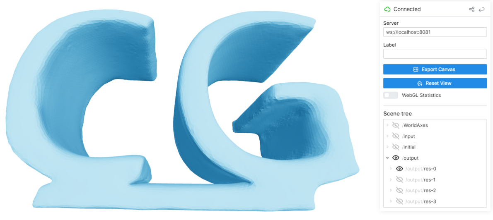

# Learning Self-Prior for Mesh Inpainting using Self-Supervised Graph Convolutional Networks

<div align="center">

<h3>
 <a href="https://ieeexplore.ieee.org/abstract/document/10430436" target="_blank" rel="noopener noreferrer">Paper</a> | 
 <a href="https://arxiv.org/abs/2305.00635" target="_blank" rel="noopener noreferrer">arXiv</a>
 <br><br>
Accepted by IEEE TVCG 2024
</h3>
</div>

<div align="center">
    <br>
    <h2 align="left">Method Overview</h2>
    <br>
</div>

## Usage

### Environments
```
python==3.10
torch==1.13.0
torch-geometric==2.2.0
```

### Installation (Docker)

```
docker image build -t astaka-pe/semigcn .
docker run -itd --gpus all -p 8081:8081 --name semigcn -v .:/work astaka-pe/semigcn
docker exec -it semigcn /bin/bash
```

### Preperation

- Unzip `datasets.zip`
- Sample meshes will be placed in `datasets/`
- Put your own mesh in a new arbitrary folder as:
    - Deficient mesh: `datasets/**/{mesh-name}/{mesh-name}_original.obj`
    - Ground truth: `datasets/**/{mesh-name}/{mesh-name}_gt.obj`
- The deficient and the ground truth meshes need not share a same connectivity but their scales must be shared

### Preprocess

- Specify the path of the deficient mesh
- Create **initial mesh** and **smoothed mesh**

```
python3 preprocess/prepare.py -i datasets/**/{mesh-name}/{mesh-name}_original.obj
```
- options
    - `-r {float}`: Target length of remeshing. The higher the coarser, the lower the finer. `default=0.6`.

- Computation time: 30 sec

### Training

```
python3 sgcn.py -i datasets/**/{mesh-name}   # SGCN
python3 mgcn.py -i datasets/**/{mesh-name}   # MGCN
```

- options
    - `-CAD`: For a CAD model
    - `-real`: For a real scan
    - `-cache`: For using cache files (for faster computation)
    - `-mu` : Weight for refinement

You can monitor the training progress through the web viewer. (Default: http://localhost:8081)

<br>

### Evaluation

- Create `datasets/**/{mesh-name}/comparison` and put meshes for evaluation
    - A deficient mesh `datasets/**/{mesh-name}/comparison/original.obj` and a ground truth mesh `datasets/**/{mesh-name}/comparison/gt.obj` are needed for evaluation

```
python3 check/batch_dist_check.py -i datasets/**/{mesh-name}
```

- options
    - `-real`: For a real scan


### Refinement (Option)

- If you want to perform only refinement, run

```
python3 refinement.py \\
    -src datasets/**/{mesh-name}/{mesh-name}_initial/obj \\
    -dst datasets/**/{mesh-name}/output/**/100_step/.obj \\     # SGCN
    # -dst datasets/**/{mesh-name}/output/**/100_step_0.obj \\    # MGCN
    -vm datasets/**/{mesh-name}/{mesh-name}_vmask.json \\
    -ref {arbitrary-output-filename}.obj \\
```

- option
  - `-mu`: Weight for refinement
    - Choose a weight so that the remaining vertex positions of the initial mesh and the shape of missing regions of the output mesh are saved

## Run other competitive methods

Please refer to [tinymesh](https://github.com/tatsy/tinymesh).

<!-- ### MeshFix [Attene 2010]

```
python3 meshfix.py -i datasets/**/{mesh-name}
```

### Context-based Coherent Surface Completion [Harary+ 2014]

```
conda activate tinymesh
python3 context_fill.py -i datasets/**/{mesh-name}
``` -->

## Citation

```
@article{hattori2024semigcn,
  title={Learning Self-Prior for Mesh Inpainting Using Self-Supervised Graph Convolutional Networks},
  author={Hattori, Shota and Yatagawa, Tatsuya and Ohtake, Yutaka and Suzuki, Hiromasa},
  journal={IEEE Transactions on Visualization and Computer Graphics},
  year={2024},
  publisher={IEEE}
}
```